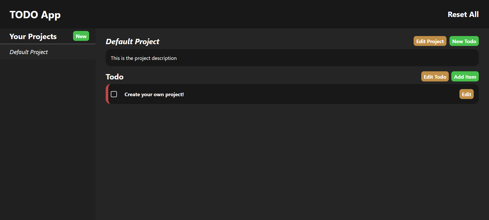

# Basic To-Do App

A simple and intuitive to-do list application built with **HTML**, **CSS**, and **JavaScript**.
This app helps users manage their tasks efficiently and stores all data locally using the browser's `localStorage`.

## Features
- Create, edit, and delete to-do items.
- Organize tasks with priorities and due dates.
- Persistent storage using `localStorage` to save data across sessions.

## Technologies Used
- **HTML**: For the structure of the app.
- **CSS**: For styling the user interface.
- **JavaScript**: For functionality and interactions.
- **npm**: For managing dependencies.
- **Webpack**: For bundling and optimizing the app.

## Live Demo
[Check out the live app here!](https://elvborn.github.io/todo-app/)

## Screenshot
